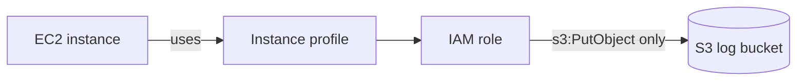

# AWS Private Server (Terraform)

**Goal:** A server that isn't directly reachable from the internet, but can
still download updates and save its logs, built stage by stage while I learn
Infrastructure as Code.


## Progress
- [x] Stage 1: EC2 instance + S3 bucket
- [x] Stage 2: IAM role so EC2 can write to S3 (no access keys)
- [ ] Stage 3: Custom VPC + private subnet
- [ ] Stage 4: NAT gateway
- [ ] Stage 5: Refactor into modules

Each stage is its own commit, so the git history shows how the project grew.

## Architecture (current: Stage 2)



On first boot, the instance runs a small script that writes `hello.txt` to the
bucket. If the file appears, the role works, with no SSH and no credentials on
the server.

## Design decisions
| Decision | Why |
|---|---|
| IAM role + instance profile instead of access keys | Credentials are temporary and automatic, so there's nothing to leak |
| Policy allows only `s3:PutObject` on this one bucket | Least privilege: a compromised server can't read or delete logs |
| S3 public access block enabled | The log bucket can never be made public by mistake |
| Random suffix on bucket name | S3 names are globally unique |
| AMI found with a `data` source | Always the latest Amazon Linux 2023, no hardcoded AMI ID |
| IMDSv2 required (`http_tokens = "required"`) | Protects instance credentials from SSRF-style attacks |
| Provider versions pinned, lock file committed | Repeatable builds |

## Project structure
```
aws-private-server/
├── README.md
├── notes.md
└── terraform/
    ├── versions.tf    # Terraform + provider versions, region
    ├── variables.tf   # Region, project name, instance type
    ├── main.tf        # EC2, S3 bucket, AMI lookup
    ├── iam.tf         # Role, policy, instance profile
    └── outputs.tf     # Instance ID, bucket name, role name
```

## How to run
Prerequisites: Terraform >= 1.5 and AWS CLI configured (`aws configure`).

```bash
cd terraform
terraform init
terraform plan
terraform apply
```

**Verify:** wait 1 to 2 minutes, then check the bucket:
```bash
aws s3 ls s3://<bucket_name>/logs/
```

**Clean up** (the NAT gateway in Stage 4 bills hourly, so get in the habit now):
```bash
terraform destroy
```

## What I learned
- A role has three parts: a trust policy (who can use it), a permissions
  policy (what it can do), and an instance profile (how it attaches to EC2)
- `user_data` only runs on first boot, so changing it requires replacing the
  instance
- Reading `terraform plan` carefully before `apply` catches mistakes early
- Assumerole by AWS and how to use it

## What broke
<!-- - Committed `.terraform/` by accident; GitHub rejected the push (provider -->
  binary over 100 MB). Fixed by adding a `.gitignore` and re-initialising
  the repo
- 

## Known limitations (being fixed in later stages)
- The instance is still in the **default VPC** with the default security
  group, so it is not private yet (Stages 3 and 4)
- Terraform state is stored locally; remote state in S3 is a future improvement

## Stage 3: Custom VPC + Private Subnet

### What this stage does
Replaces the default VPC with a custom VPC and places the EC2 instance in a 
private subnet with no route to the internet — the instance is unreachable 
from outside AWS, but can still write logs to S3 via the IAM role from Stage 2.

### Resources created
| Resource | ID |
|---|---|
| VPC | `vpc-00da010662add82e7` |
| Private subnet | `subnet-047d518b7353c6165` |
| EC2 instance | `i-0498f9e1b4bea6cdb` |
| Private IP | `10.0.1.5` |
| IAM role | `aws-private-server-server-role` |
| S3 bucket (logs) | `aws-private-server-logs-76de6d51` |

### Verification
- Confirmed the instance has **no public IP** (`PublicIpAddress: None` via `aws ec2 describe-instances`)
- Confirmed SSH from a local machine to `10.0.1.5` times out — subnet has no route to/from the internet
- IAM role from Stage 2 still allows the instance to write logs to S3 despite no internet access

### What's intentionally missing
No NAT gateway yet, so the instance can't reach the internet for updates. 
That's Stage 4.

